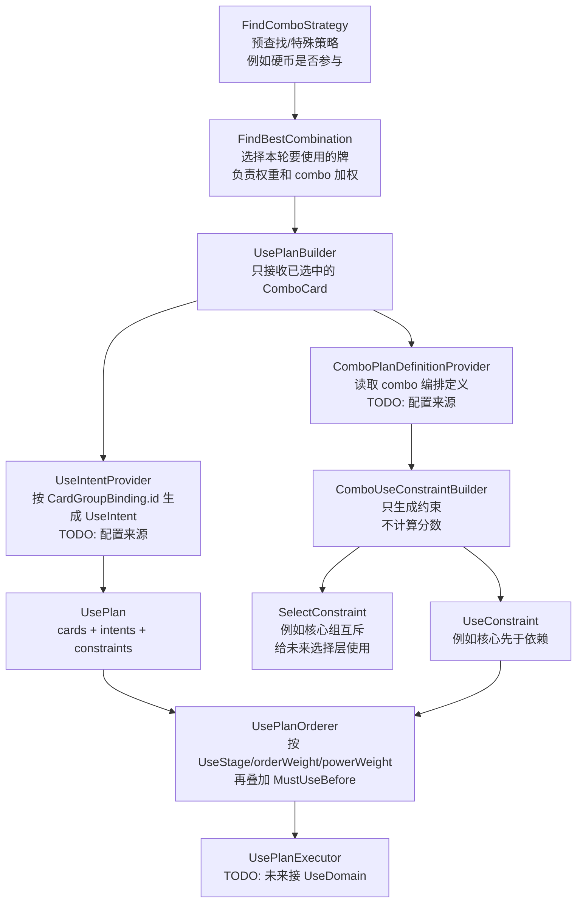

# 新使用编排骨架：不加测试版

## Summary

先只实现新使用编排核心骨架，不接旧 `useGroupId` 体系，不加测试文件，不改测试配置。目标是把模型边界落出来：选择约束、combo
加权、使用顺序、使用意图分开。

## Key Changes

- 新增 `lin.domain.use.plan` 包，放新编排模型。
- 新增核心数据模型：
    - `UseStage`：默认阶段，如资源、准备、清场、combo、普通价值、收尾。
    - `UseTag`：只做标记，每个枚举加中文注释，避免看不懂。
    - `UseIntent`：一张牌的使用意图，包含 `stage/tags/orderWeight`。
    - `ComboPlanDefinition`：新 combo 定义，包含 `coreGroupIds/depGroupIds/coreMutex/relation`。
    - `ComboRelation`：区分只加权、核心先于依赖、依赖先于核心、相邻打出。
    - `SelectConstraint`：选择约束，例如核心组互斥。
    - `UseConstraint`：使用顺序约束，例如 A 必须先于 B。
- 新增核心骨架类：
    - `ComboUseConstraintBuilder`：负责从 combo 关系生成核心互斥和使用顺序约束，非核心逻辑用 `TODO()`。
    - `UsePlanBuilder`：负责把候选牌、意图、combo 定义组装成 `UsePlan`，复杂来源先占位。
    - `UsePlanOrderer`：负责按 `UseConstraint` 和 `UseStage` 排序，先实现最小可读骨架。
    - `UsePlanExecutor`：只声明接口或占位类，不接真实打牌流程。
- 不新增测试文件，不改 `.gitignore`，不处理 Surefire/JUnit 配置。

## Implementation Notes

- 不写旧体系适配层；`useGroupId/useGroupOrder/FirstUseGroupId/CleanWarId` 不进入新模型。
- `UseTag` 不参与排序裁决，只用于标记、调试、后续策略识别。
- 核心互斥属于选择阶段，不能放进排序阶段。
- 旧 `UseOrderPlanner` 保留为当前止血逻辑，不继续往里面叠新特例。
- 新代码尽量纯 Kotlin，不依赖 Koin、DB、Spring、JavaFX。

## Assumptions

- 第一版只看结构，不追求接入真实出牌；选牌和分数仍由 FindBestCombination / FindComboStrategy 负责。
- combo 定义未来以 `CardGroupBinding.id` 为组身份。
- DB、UI、旧配置迁移、真实执行接入都放到后续步骤。

## 流程图

