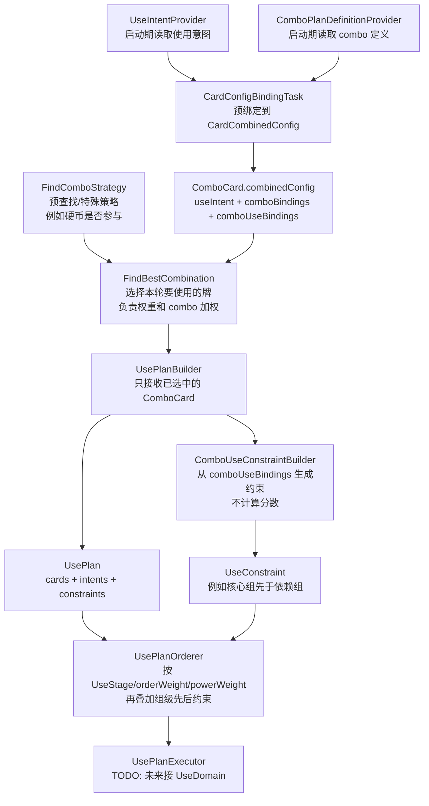

## Summary

先只实现新使用编排核心骨架，不接旧 `useGroupId` 体系，不加测试文件，不改测试配置。目标是把模型边界落出来：combo
加权和核心互斥留在选牌阶段，使用顺序和使用意图留在出牌编排阶段。

## Key Changes

- 新增 `lin.domain.use.plan` 包，放新编排模型。
- 新增核心数据模型：
    - `UseStage`：默认阶段，如资源、准备、清场、combo、普通价值、收尾。
  - `PurposeTag`：规则/评估侧的宏观用途标签，例如保命、解场、贪婪、斩杀。
      - `UseIntent`：一张牌的使用意图，包含 `stage/replanAfterUse/orderWeight`。
    - `ComboPlanDefinition`：新 combo 定义，包含 `coreGroupIds/depGroupIds/coreMutex/relation`。
  - `ComboRelation`：区分只加权、核心组先于依赖组、依赖组先于核心组。
  - `UseConstraint`：使用顺序约束，例如某组牌必须先于另一组牌。
- 新增核心骨架类：
  - `ComboUseConstraintBuilder`：负责从 `CardCombinedConfig.comboBindings` 生成使用顺序约束。
  - `UsePlanBuilder`：负责把候选牌、已绑定意图、已绑定 combo 关系组装成 `UsePlan`。
    - `UsePlanOrderer`：负责按 `UseConstraint` 和 `UseStage` 排序，先实现最小可读骨架。
    - `UsePlanExecutor`：只声明接口或占位类，不接真实打牌流程。
- 不新增测试文件，不改 `.gitignore`，不处理 Surefire/JUnit 配置。

## Implementation Notes

- 不写旧体系适配层；`useGroupId/useGroupOrder/FirstUseGroupId/CleanWarId` 不进入新模型。
- `PurposeTag` 只描述规则/评估侧的“为什么选”，默认出牌阶段由 `UseIntentDeriver` 映射到 `UseStage`。
- 特例直接配置 `stageOverride`，不要再通过额外标签间接影响排序。
- 使用后重规划用 `replanAfterUse` 显式表达，不再放在标签集合里。
- `CardComboBinding` 只服务选牌评分/硬互斥；`CardComboUseBinding` 只服务出牌顺序，避免负分软惩罚影响编排关系。
- `UseConstraint` 保持组级关系，由 UsePlanOrderer 在本轮 UsePlan 中解析成具体卡牌先后；不要在定义阶段用 zip 把 core/dep
  打包成两张牌。
- `mustAdjacent` 暂时不消费，强相邻关系后续要单独设计组块/窗口语义。
- 核心互斥属于选择阶段，不能放进排序阶段；当前由 `FindBestCombination` 直接消费 `CardComboBinding.coreMutex`。
- `coreMutex` 只表达“不同核心组绝对不能同时选”的硬限制；一般性“不希望同时出”继续用负 `score` 做软惩罚。
- `UseIntentProvider` 和 `ComboPlanDefinitionProvider` 只在 `CardConfigBindingTask` 启动期读取；运行期通过
  `ComboCard.combinedConfig`
  直接消费 `useIntent` / `comboBindings` / `comboUseBindings`。
- 旧 `UseOrderPlanner` 保留为当前止血逻辑，不继续往里面叠新特例。
- 新代码尽量纯 Kotlin，不依赖 Koin、DB、Spring、JavaFX。
- 暂不把 Tag 做成配置化注册表；当前 enum + SQLite 字符串足够表达最小模型，后续确实需要自定义标签时再引入
  TagDefinition/TagRef。
- 硬币当前仍保留负权重和 `ExtCostStrategy` 查找阶段直接使用的旧行为；职责切割实验留到后续单独处理。

## Assumptions

- 第一版只看结构，不追求接入真实出牌；选牌和分数仍由 FindBestCombination / FindComboStrategy 负责。
- combo 核心/依赖关系由 `ComboPlanDefinition` 和启动期预解析的 combo 绑定承载，不再用出牌标签表达。
- combo 定义未来以 `CardGroupBinding.id` 为组身份。
- DB、UI、旧配置迁移、真实执行接入都放到后续步骤。

## 流程图

