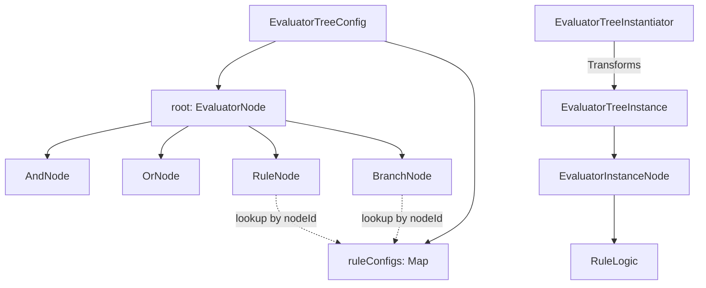

# 评估树 (Evaluator Tree) 架构说明与术语表

本文档描述了 `lin.rule.tree` 包下的评估树架构及其相关术语。

## 1. 术语表 (Glossary)

| 术语 (English)                  | 中文名称    | 说明                                                                      |
|:------------------------------|:--------|:------------------------------------------------------------------------|
| **EvaluatorTreeConfig**       | 评估树配置   | 定义评估树结构的配置类，包含根节点和规则的具体配置。                                              |
| **EvaluatorNode**             | 评估节点    | 评估树的结构定义接口（密封接口），定义了树的逻辑拓扑。                                             |
| **RuleConfig**                | 规则配置    | 定义规则节点的运行时参数，如权重、参数映射等。                                                 |
| **nodeId**                    | 节点 ID   | 在树结构中唯一标识一个节点的字符串。                                                      |
| **ruleId**                    | 规则 ID   | 规则逻辑的唯一标识符（对应 `RuleRegistry` 中的注册项）。                                    |
| **weight**                    | 匹配权重    | 当规则匹配（成功）时贡献的分数/权重。                                                     |
| **mismatchedWeight**          | 不匹配权重   | 当规则不匹配（失败）时贡献的分数/权重（通常为 0 或负数）。                                         |
| **args**                      | 规则参数    | 传递给规则逻辑执行的 KV 参数对。                                                      |
| **bindByGroupId**             | 绑定组 ID  | 将评估树关联到特定组（如卡组、单位组）的标识符。                                                |
| **EvaluatorTreeInstance**     | 评估树实例   | 经过实例化后的评估树，包含可直接执行的规则逻辑。                                                |
| **EvaluatorInstanceNode**     | 评估节点实例  | 实例化后的节点，持有 `RuleLogic` 对象。                                              |
| **RuleLogic**                 | 规则逻辑    | 规则的实际执行代码接口。                                                            |
| **RuleRegistry**              | 规则注册表   | 管理和创建规则逻辑实例的中心注册机构。                                                     |
| **EvaluatorTreeInstantiator** | 评估树实例化器 | 将 `EvaluatorTreeConfig` (静态配置) 转换为 `EvaluatorTreeInstance` (可执行实例) 的工具。 |

---

## 2. 架构说明 (Architecture)

评估树系统采用了 **配置与执行分离** 的设计模式，主要分为两个阶段：

### 2.1 配置阶段 (Configuration Phase)

- **核心类**: `EvaluatorTreeConfig`, `EvaluatorNode`
- **目的**: 定义“要做什么”。
- **特点**:
    - 纯数据类（Data Class），易于序列化（如转为 JSON）。
    - 通过 `nodeId` 引用 `RuleConfig`，实现结构定义与参数定义的解耦。
    - 支持复杂的逻辑组合（AND, OR, NOT）和条件分支（Branch）。

### 2.2 实例化阶段 (Instantiation Phase)

- **核心类**: `EvaluatorTreeInstantiator`, `RuleRegistry`
- **目的**: 准备“怎么做”。
- **特点**:
    - `EvaluatorTreeInstantiator` 遍历配置树。
    - 通过 `RuleRegistry` 根据 `ruleId` 和 `RuleConfig.args` 创建真实的 `RuleLogic` 实例。
    - 将 `nodeId` 引用的配置注入到对应的节点中。

### 2.3 执行阶段 (Execution Phase)

- **核心类**: `EvaluatorTreeInstance`, `EvaluatorInstanceNode`
- **目的**: “实际运行”。
- **特点**:
    - 实例化后的树可以直接递归调用，评估战场状态并计算最终得分或结果。
    - 规则逻辑被预先加载，执行效率高。

---

## 3. 节点逻辑关系图

