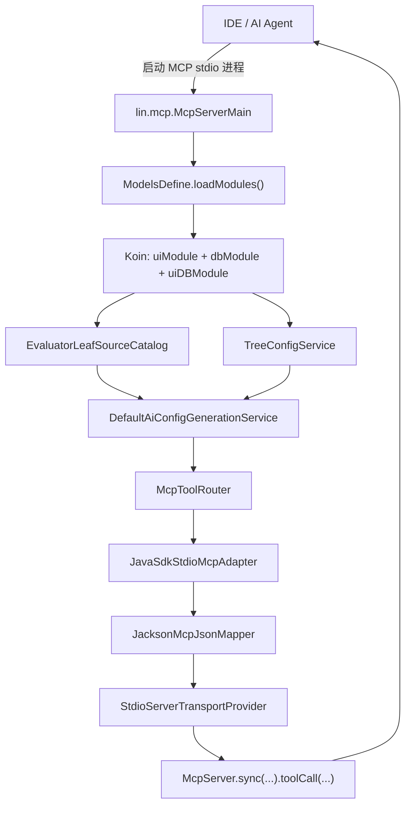
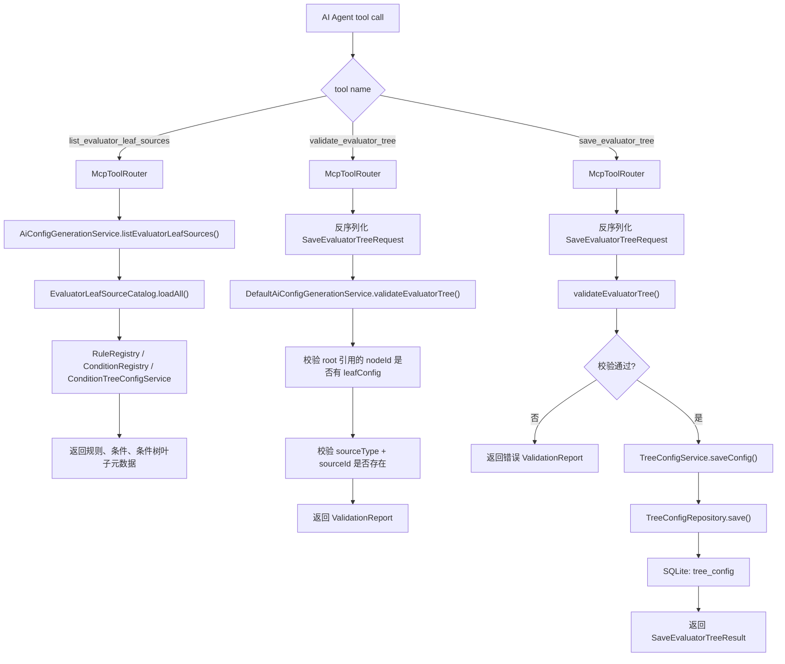
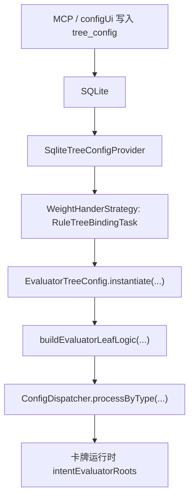

# MCP 配置生成流程 - ai-config-generator

## 入口启动流

## Tool 调用流

## 运行期消费流

## 当前边界

- `lin.mcp`: 只负责 MCP 协议、stdio、tool 注册和 SDK 类型转换。
- `lin.ai.config`: 负责 AI 配置生成业务入口，包括元数据查询、作者侧校验和保存。
- `TreeConfigService / TreeConfigRepository`: 负责评估树配置序列化与 SQLite 持久化。
- `WeightHanderStrategy`: 运行期读取正式配置并解释为可执行规则树。

## 需要改造的事项

### 必须补齐

- `P-001`: `EvaluatorLeafConfig.args` 需要按 `RuleFieldSpec` 做必填和类型校验。
- `P-002`: MCP `inputSchema` 当前仍是宽松 object，需要补成更精确的 `EvaluatorTreeConfig` JSON Schema。
- 编译验证: 当前 `configUi` 编译被既有 `card_group` / `combo_plan` 字段不一致阻断，MCP 接入只能做部分验证。

### 需要评估后再改

- `U-001`: 运行契约校验是否抽到 `WeightHanderStrategy`，以及 validator 是否依赖 `RuleRegistry`、`ConditionRegistry`、
  `ConditionTreeConfigProvider`。
- 元数据描述字段: 判断规则、条件、条件树、评估树、卡组/用途标签等引用数据是否都需要 `description`。
- 元数据分类字段: 判断条件是否加 `category/categoryDesc`，以及规则/条件树/评估树是否也需要分类。
- 模板与正式数据共表: 评估 `tree_config.is_template` 是否足够，运行期 provider 是否已经稳定排除模板。

### 暂不展开

- AI 生成 `ConditionTreeConfig` 或更细的条件逻辑。
- AI 自动改写已有条件树/评估树的版本管理、冲突处理和回滚策略。
