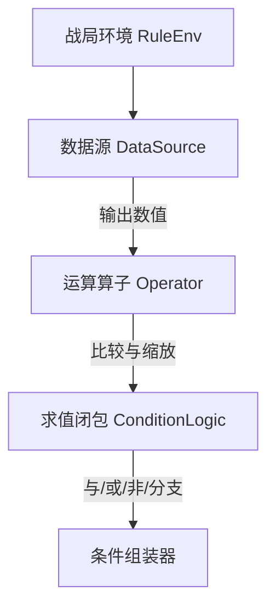
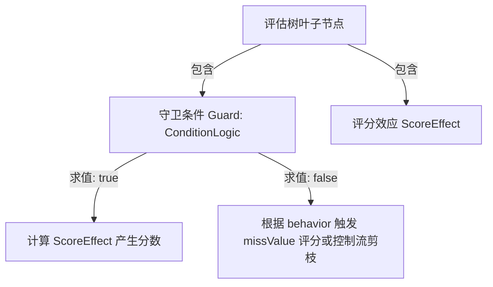

# 物理基座与方向导航 (MINIMAL-MODEL.md)

本文件作为 `orthogonal-condition` 主题下正交条件底座与评估树规则正交化设计的唯一物理基座地图，常驻于根目录下，用以指导后续演进并防范上下文丢失。

---

## 模块一：条件正交化底座 (Condition Orthogonalization Foundation)

定义了数据抽取、算子运算、动态编译与正交条件注册的核心基础。

### 1. 核心文件清单

| 文件                                                                                                                                                               | 职责说明                                                | 关联     |
|------------------------------------------------------------------------------------------------------------------------------------------------------------------|-----------------------------------------------------|--------|
| [DataSourceProvider.kt](file:///g:/liw_work/jiaoBen/Deck-Plugin-Market/WeightHanderStrategy/src/main/kotlin/lin/serviceLoader/provider/DataSourceProvider.kt)    | 数据源 SPI 抽象接口，定义 `DataSource` 行为                     | SPI 接口 |
| [OperatorProvider.kt](file:///g:/liw_work/jiaoBen/Deck-Plugin-Market/WeightHanderStrategy/src/main/kotlin/lin/serviceLoader/provider/OperatorProvider.kt)        | 比较算子 SPI 抽象接口，定义 `ScoreOperator` / `Operator` 行为    | SPI 接口 |
| [Operator.kt](file:///g:/liw_work/jiaoBen/Deck-Plugin-Market/WeightHanderStrategy/src/main/kotlin/lin/rule/condition/orthogonal/Operator.kt)                     | 算子定义与运算示例（如 `identity`, `linear`, `reverse_linear`） | 核心计算   |
| [ConditionAssembler.kt](file:///g:/liw_work/jiaoBen/Deck-Plugin-Market/WeightHanderStrategy/src/main/kotlin/lin/rule/condition/orthogonal/ConditionAssembler.kt) | 动态条件组装、类型校验与 AST 构建                                 | 编译与组装  |
| [ConditionRegistry.kt](file:///g:/liw_work/jiaoBen/Deck-Plugin-Market/WeightHanderStrategy/src/main/kotlin/lin/rule/condition/ConditionRegistry.kt)              | 拦截动态条件编译，提供传统硬编码条件与正交组件并存注册                         | 注册中心   |
| [FieldParser.kt](file:///g:/liw_work/jiaoBen/Deck-Plugin-Market/WeightHanderStrategy/src/main/kotlin/lin/rule/parse/FieldParser.kt)                              | 核心反射解析元数据规格工具，抽取 properties 元数据                     | 反射工具   |

### 2. 方向总览 (条件解耦)

整体方向围绕“解耦数据提取与逻辑算子”展开：

1. **DataSource**：纯粹无状态地根据战局 `RuleEnv` 和上下文 `RuleContext` 抽取所需数值（如手牌数、法力、随从种族）。
2. **Operator**：纯粹进行数值/集合间的比较运算（如大于等于、包含等），并携带声明式 `FieldSpec` 契约约束。
3. **ConditionAssembler**：将 `(DataSource + Operator + Args)` 拼装为通用的 `ConditionLogic`（Kotlin
   闭包），并在装配时做前置契约合法性与类型相容性校验。
4. **ConditionRegistry**：提供自适应路由，如果发现输入参数字典具有数据源和算子特征参数，自动将其重定向给
   `ConditionAssembler` 进行动态拼装，从而完全兼容手写简单条件的升级路径。

### 3. 核心架构拓扑

---

## 模块二：评估树规则正交化 (Evaluator Rule Orthogonalization)

构建在条件底座之上，将传统规则解耦为 `守卫(Guard) + 评分效应(ScoreEffect) + 动作(Action)`，并在评估树中组合表达。

### 1. 核心文件清单

| 文件                                                                                                                                                     | 职责说明                                                  | 关联     |
|--------------------------------------------------------------------------------------------------------------------------------------------------------|-------------------------------------------------------|--------|
| [ScoreEffect.kt](file:///g:/liw_work/jiaoBen/Deck-Plugin-Market/WeightHanderStrategy/src/main/kotlin/lin/rule/score/ScoreEffect.kt)                    | ConstantScore/SourceScore 等评分效应多态子类定义（各带 `missValue`） | 评分效应   |
| [ScoreOperator.kt](file:///g:/liw_work/jiaoBen/Deck-Plugin-Market/WeightHanderStrategy/src/main/kotlin/lin/rule/score/ScoreOperator.kt)                | `ScoreOperator<I,P>` 接口与 DSL 构建器，连接数据源与分数             | 评分算子   |
| [EvaluatorTreeInstance.kt](file:///g:/liw_work/jiaoBen/Deck-Plugin-Market/WeightHanderStrategy/src/main/kotlin/lin/rule/tree/EvaluatorTreeInstance.kt) | 评估树节点解析绑定与前置契约校验，短路剪枝机制                               | 评估树执行器 |
| [RuleTreeBinding.kt](file:///g:/liw_work/jiaoBen/Deck-Plugin-Market/WeightHanderStrategy/src/main/kotlin/lin/rule/handler/RuleTreeBinding.kt)          | `toGuardScoreRule` 绑定逻辑，负责编译校验与多态叶子节点绑定               | 绑定装配器  |
| [RuleBuilder.kt](file:///g:/liw_work/jiaoBen/Deck-Plugin-Market/WeightHanderStrategy/src/main/kotlin/lin/rule/build/RuleBuilder.kt)                    | 新增 `scoreEffectType()` 声明，支持声明式 builtInFields 生成      | 规则生成器  |

### 2. 方向总览 (评分效应与守卫三态)

评分效应体系把"条件算分"收敛为 **Guard (守卫) + ScoreEffect (评分效应)** 两个核心抽象：

- **门控与评分**：`CONDITION / CONDITION_TREE` 在评估树普通叶子中只负责返回布尔值门控。守卫命中时执行 `ScoreEffect`
  计算分数，未命中时根据 behavior 触发 missValue 评分或控制流剪枝。
- **数据与算分复用**：`ScoreEffect.SourceScore` 直接复用正交条件已有的 `DataSource` 提取数据，再通过 `ScoreOperator`
  将输出转化为分数。Branch 控制位不再复用规则的 Prune 语义，直接绑定 `ConditionLogic`。
- **收敛为三层叶子模型**：
    1. *CONDITION / CONDITION_TREE*：固定 ConstantScore， builtInFields 统一为 `[constantScore, missValue]`，无需再在 UI
       选择评分类型。
    2. *编码 Rule*：通过 `RuleRegistration.scoreEffectType` 声明评分类型（CONSTANT 默认 / SOURCE / NONE），框架自动按声明动态生成
       builtInFields。
    3. *配置型 Rule*：为全量 ScoreEffect 动态参数表单预留接口。

### 3. 核心架构拓扑

---

## 收敛与标记状态

历史迭代中的缺陷标记 (如 U-001 ~ U-006) 详情已归档。当前最新物理代码中已不存在 `ARCH-UNSETTLED`
等阻碍编译的标记，模型已完全收敛至真实代码中。后续新任务若引入新的待验证标记，将在此处追加记录。
