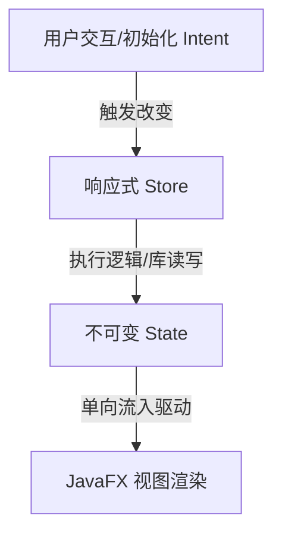

# JavaFX 策略配置客户端开发架构指南 (GUI Development Guide)

本指南旨在固化本项目在“卡牌用途配置”与“Combo 编排配置”开发过程中沉淀出的**工业级 JavaFX 架构设计规范与最佳工程实践**。
未来的 AI 编码助手或开发者在为本项目开发新的 UI 模块时，**必须严格遵循本指南中定义的架构风格、生命周期以及样板代码简化模式
**。

---

## 目录

1. [核心架构理念 (Core Philosophy)](#1-核心架构理念-core-philosophy)
2. [生命周期与副作用解耦 (ActiveAware Lifecycle)](#2-生命周期与副作用解耦-activeaware-lifecycle)
3. [双态合并单表配置模式 (Single-Table-Dual-Column)](#3-双态合并单表配置模式-single-table-dual-column)
4. [JavaFX 声明式列扩展工具 (TableView Boilerplate Elimination)](#4-javafx-声明式列扩展工具-tableview-boilerplate-elimination)
5. [数据与持久化最佳实践 (Data & Id Generator)](#5-数据与持久化最佳实践-data--id-generator)
6. [Koin 依赖注入与路由菜单注册 (DI & Router)](#6-koin-依赖注入与路由菜单注册-di--router)

---

## 1. 核心架构理念 (Core Philosophy)

本项目客户端严格采用 **响应式单向数据流 MVI (Model-View-Intent)** 架构：



* **State (不可变状态)**：代表 UI 在某一时刻的绝对投影（例如 `ComboPlanState`），只包含纯数据实体。
* **Store (状态管理器)**：承载所有的业务状态扭转与 SQLite 数据库或文件的持久化交互，View 通过订阅 Store 的状态流实现自动渲染。
* **View (解耦视图)**：**严禁** 在 View 内部平铺大段业务更新逻辑。所有的子编辑器（如 `ComboPlanEditor`）与主面板（
  `ComboPlanWorkbench`）必须相互解耦，数据通过接口或函数式回调（如 `onSave`, `onDelete`）流转，严禁直接跨组件读取或修改其它组件的私有控件。

---

## 2. 生命周期与副作用解耦 (ActiveAware Lifecycle)

### 🚨 核心原则：构造函数无副作用 (Constructor Does Too Much Anti-Pattern)

构造函数或 Kotlin `init` 块的唯一职责是 **静态 UI 布局的组装与 UI 节点创建**。
**严禁** 在构造函数或 `init` 块中执行任何有副作用的操作，如读写 SQLite 数据库、扫描本地卡组 JSON 文件等。

### 💡 黄金解决方案：`ActiveAware` 激活感知

当开发新的功能面板时，`Workbench` 必须实现 `lin.ui.ActiveAware` 接口：

```kotlin
class NewFeatureWorkbench : SplitPane(), KoinComponent, ActiveAware {
    init {
        setupLayout()      // 1. 纯静态布局组装，极速且无副作用
        bindStateStreams() // 2. 绑定 UI 响应流
    }

    override fun onActive() {
        // 3. 🚀 安全、按需的懒加载。当且仅当面板被用户点击展示时触发
        store.loadInitialData()
    }
}
```

* **全局容器联动**：主外壳 `MainShellView` 在切换面板时会自动拦截该接口并显式分发调用：
  ```kotlin
  if (node is ActiveAware) {
      node.onActive()
  }
  ```

---

## 3. 双态合并单表配置模式 (Single-Table-Dual-Column)

对于存在“多对多勾选绑定”且包含数十个分组的复杂映射配置（例如将 Combo 绑定到卡组中的 bindings，划分核心/依赖组），*
*严禁使用低效的双栏穿梭框或两个独立的滚动区域**。这会导致极差的拖拽对齐操作体验。

### 💡 黄金设计：双态单表

采用单个 `TableView<BindingUiRow>` 承载，左侧为名称，右侧并排展示 **【核心】** 与 **【依赖】** 两个独立 CheckBox
列。用户在单行内直接一目了然地勾选关系。

### ⚠️ 避坑指南：规避 JavaFX 表格行复用 Bug

TableView 在垂直滚动时，行节点会被复用，如果直接绑定复选框状态，会触发“复选框值飘移/勾选错乱”的经典 UI Bug。
必须采用**高内聚事件拦截机制**封装单元格工厂：

```kotlin
fun createCheckBoxColumnCellFactory(
    bindingsTableView: TableView<BindingUiRow>,
    isCore: Boolean
): Callback<TableColumn<BindingUiRow, Boolean>, TableCell<BindingUiRow, Boolean>> {
    return Callback { _ ->
        object : TableCell<BindingUiRow, Boolean>() {
            private val cb = CheckBox()
            init {
                alignment = Pos.CENTER
                cb.setOnAction {
                    val rowIndex = index
                    if (rowIndex in bindingsTableView.items.indices) {
                        val rowData = bindingsTableView.items[rowIndex]
                        if (isCore) rowData.coreProperty.set(cb.isSelected)
                        else rowData.depProperty.set(cb.isSelected)
                    }
                }
            }
            override fun updateItem(item: Boolean?, empty: Boolean) {
                super.updateItem(item, empty)
                if (empty || item == null) {
                    graphic = null
                } else {
                    cb.isSelected = item
                    graphic = cb
                }
            }
        }
    }
}
```

---

## 4. JavaFX 声明式列扩展工具 (TableView Boilerplate Elimination)

为了彻底消灭繁琐且高重复的 `TableColumn`、`setCellValueFactory` 和 `SimpleStringProperty` 实例化样板代码，本项目在
`lin.utils` 包中提供了极简的通用声明式扩展函数。

### 🛠️ 核心 API: `addColumn`

```kotlin
// lin.utils.JavaFxUtils.kt 中定义
fun <S> TableView<S>.addColumn(
    title: String,
    width: Double? = null,
    isCentered: Boolean = false,
    valueProvider: (S) -> String
): TableColumn<S, String>
```

### ⚡ 声明对比 (Before vs After)

* **Before (糟糕的平铺声明)**：
  ```kotlin
  val colId = TableColumn<ComboPlanDefinition, String>("ID").apply {
      setCellValueFactory { SimpleStringProperty(it.value.id) }
      prefWidth = 80.0
  }
  columns.add(colId)
  ```
* **After (极其清爽的声明式 UI)**：
  ```kotlin
  tableView.apply {
      addColumn("ID", 80.0) { it.id }
      addColumn("分值", 60.0, isCentered = true) { String.format("%.1f", it.score) }
      addColumn("出牌顺序", 90.0) { it.relation.toChineseDesc() }
  }
  ```

---

## 5. 数据与持久化最佳实践 (Data & Id Generator)

### 🆔 8位时间有序短 ID 生成器

本项目采用高内聚顶级函数 `fun nextShortId(): String` 取代冗长且对索引不友好的传统 UUID：

* **前 6 位**：采用**秒级时间戳的 Base36 编码**。这使得生成的 8 位短 ID 在时间轴上**天然整体递增**，这对于 SQLite 的 B-Tree
  主键索引极其友好，极大程度规避了物理页分裂与索引碎片。
* **后 2 位**：UUID 混淆字符，彻底消除一秒内高并发碰撞的概率。

### 🏷️ 翻译与具名参数 (Named Parameters)

* **翻译收口**：将配置枚举（如 `ComboRelation`）翻译为前台简洁中文文案时，统一在领域物理模型中实现为扩展函数
  `ComboRelation.toChineseDesc()`，禁止在各 UI 视图中重复硬编码。
* **具名参数**：调用持久化写入方法（如 `store.savePlan`）时，**必须使用 Kotlin 具名参数（Named Parameters）调用**
  ，规避因多参数顺序调整带来的运行期字段错位 Bug。

---

## 6. Koin 依赖注入与路由菜单注册 (DI & Router)

开发完成一个独立功能模块后，必须按照以下规范进行无缝挂载，杜绝耦合：

1. **注册 Koin 仓储与导航组件**：
   在 `lin.moduls.ModelsDefine.kt` 中：
   ```kotlin
   val uiDBModule = module {
       single { NewFeatureRepository() } // 注册 SQLite 数据源
   }

   val uiModule = module {
       single<UiExtension> { NewFeatureExtension() } // 注册菜单导航扩展
   }
   ```
2. **实现导航路由扩展**：
   在对应包下实现 `UiExtension`，通过设定 `order` 属性确定左侧功能列表的相对排位顺序：
   ```kotlin
   class NewFeatureExtension : UiExtension {
       override val title: String = "新功能配置"
       override val order: Int = 9 // 顺序码越大，在侧边栏显示越靠下
       override fun createWorkbench(): Node = NewFeatureWorkbench()
   }
   ```

---

*若您需要为系统增加新的规则或用途配置，请务必完整阅读并实践本指南中定义的这一套优雅的架构逻辑。祝编码愉快！*
